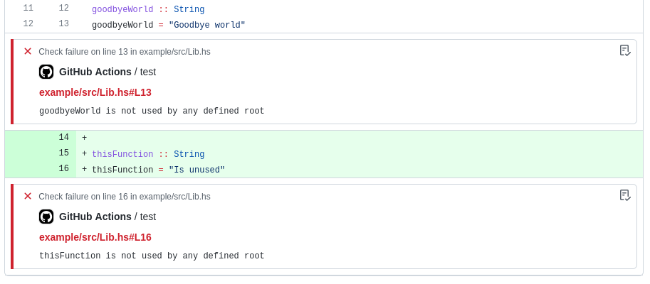

# Weeder Action

GitHub Action to run Weeder to find any unused functions in a Haskell project
and annotate the Build with their locations.



## Prerequisites

See the [Weeder README][weeder] for project requirements.

[weeder]: https://github.com/ocharles/weeder#readme

You will need to run this step in the same Job as you compile your project, or
make the `.hie` files available some other way.

This Action only supports [Stack]-based projects at this time: it uses
`stack install` to install `weeder` and `stack exec` to run it. PRs are very
welcome to support alternatives such as Cabal or Nix.

[stack]: https://docs.haskellstack.org/en/stable/README/

## Usage

```yaml
steps:
  - uses: actions/checkout@v2
  - uses: freckle/stack-cache-action@v1
  - uses: freckle/stack-action@v3
  - uses: freckle/weeder-action@v1
```

## Inputs

See [`action.yml`](./action.yml) for a complete and up to date list.

## Outputs

This Action sets an output named `log` to the path containing the output of
running `weeder`. This can be useful if you use `fail: false` and wish to do
something on that output yourself afterwards.

---

[LICENSE](./LICENSE)
